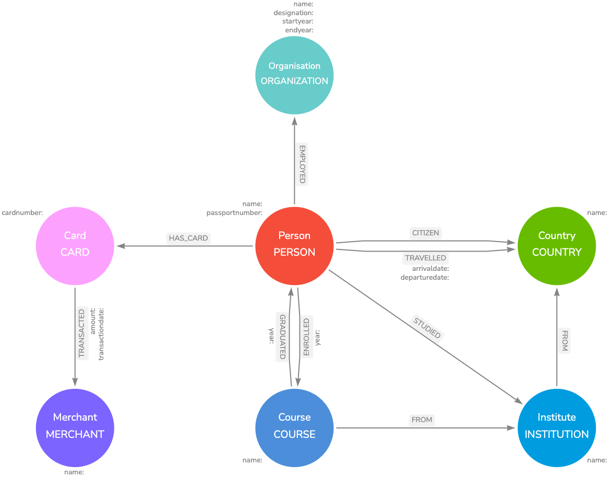
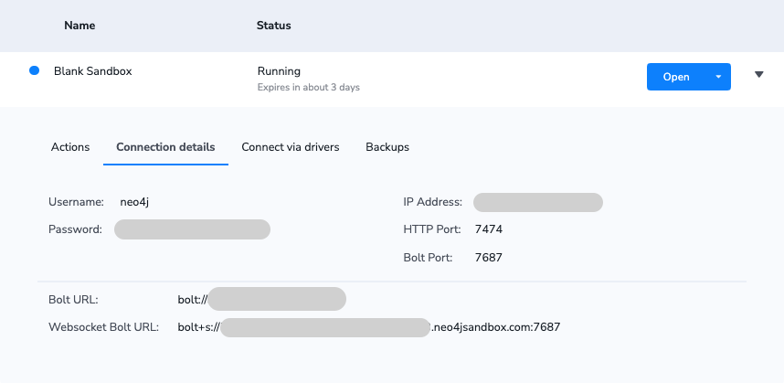

# Graph Exploration with Neo4j

This repository demostraits an overview on tabular data ingestion to Neo4j graph database following some graph analytics and visualition. In addition, it shows how to buid a RESTfull API endpoint to execute Cypher query estatement. In this exercise, we build application based on Neo4j python driver on Neo4j sandbox environment. This exercise can be done locally using Neo4j Desktop.

The Knowledge Grapgh Game dataset from [KG Game Neo4j]() is used for this exercise. There are four separate tabular datasets as follow:

- [Education](./data/sng_education.csv)
- [Work](./data/sng_work.csv)
- [Trips](./data/sng_trips.csv)
- [Transactions](./data/sng_transaction.csv)

## Tabular to Graph Data Modelling

The firt step prior to create an ingestion pipeline is to understand data model and relationships. Using the structure and accossation in tabular datasets, we can start creating a visual data model. To create a visual data model, we used [arrows.app](https://arrows.app/). Below is the visual representation of the graph with it's nodes, relationships, and their properties:



We can also export the data model as a JSON file. Here is the exported data model [file](./data_model/graph_exploere.josn) in JSON.

## Data Ingestion to a Graph

To ingest the above CSV files to Neo4j Graph Databse using a python application, there are some prerequisites that need to be setup.

### Prerequisites

#### Neo4j GraphDB abd GraphDS
To perform this exercise, we need to have Neo4j graph database (GraphDB) abd graph data sciance (GraphDS) on an instance. There are a few ways to set an instance for this purpose; using Neo4j Desktop, Neo4j Sandbos, Neo4j AuraDB and AuraDS. In this exercise, we use Neo4j sandbox. Once a snadbox is set up, it provides Connection Details for remote access as below: 



#### Python Environment
Python 3 is required to create an application to enable a graph and connect to the Neo4j sandbox for execution. In this exercise, we use Google Colab Jupyter Notebook for coding and execution. Note that, we can use any other Python environmen and client. The Colab runtime needs some python modules to prepare the environment for connection to sandbxo and execution. Once a Jupyter notebook on Colab connects to runtime and is running,we install Neo4j modules:

```python
!pip install neo4j graphdatascience
```

Follwoing the execution of modules import:

```python
import pandas as pd
from neo4j import GraphDatabase
from graphdatascience import GraphDataScience
from neo4j.exceptions import ServiceUnavailable
```

## Graph Analytics

## RESTfull API to Execute Cypher Queris
